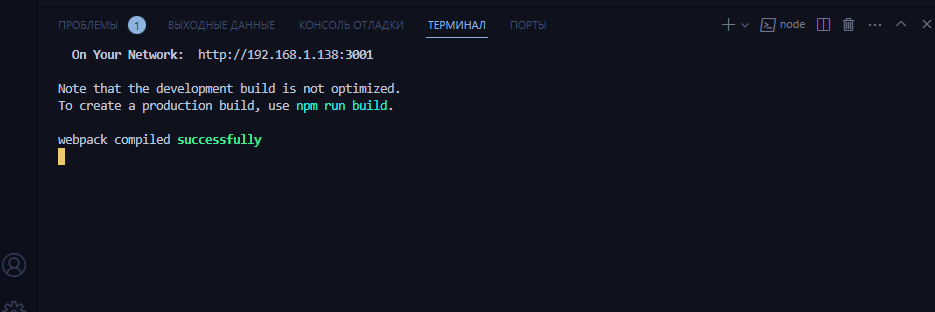

### Создатели : Лада Александр, Филиппов Кирилл

---

## Сайт для лабораторных работ
* Выполнение простейших арифметических действий, представленное в виде калькулятора чисел
* Чат-переписка между пользователем и программой

---

### `Инструкция к применению`

1. [Клонировать](https://docs.github.com/en/repositories/creating-and-managing-repositories/cloning-a-repository) проект в нужную вам папку на компьютере
2. Открыть проект в [VsCode](https://code.visualstudio.com/download) (Visual Studio Code)
3. Запустить программу написав в консоли `npm start`

    Затем в вашем браузере откроется вкладка с данным сайтом.

---

### `Использование`

* На сайте по желанию можно поменять тему
* Введите 2 числа в левое и среднее поле и нажимайте на кнопки арифметических действий. В правом поле увидите результат
* Далее нажимайте `начать общение`. По запросу программы вводите данные и нажимайте кнопку отправки

---

